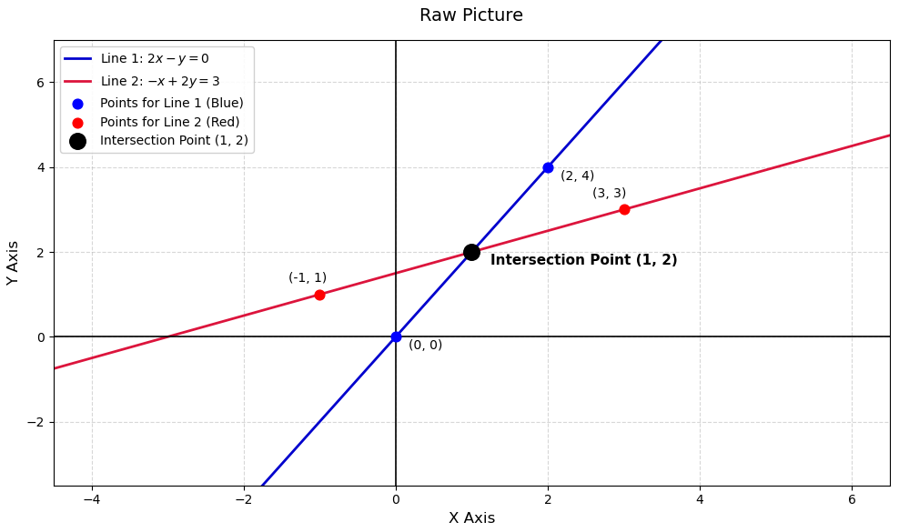

# 线性方程的几何表示

## 一元一次方程

一元一次方程的几何解释就是一个值，如 $4x=40$ ，它的表示就是$x=5$这个值。

## 二元一次方程

二元一次方程的几何表示是一个二维象限中的一个点，如：

$$
2x - y = 0 \\
-x + 2y = 3
$$

这组方程组在线性代数中，可以用矩阵乘法来表示，如下：

$$
\begin{bmatrix}
1 & 2 \\
3 & 4
\end{bmatrix}
\begin{bmatrix}
x \\
y
\end{bmatrix}
= 
\begin{bmatrix}
0 \\
3
\end{bmatrix}
$$

如果我们用$A$ 替代左边的二维矩阵，$X$替代未知数矩阵，$B$来表示结果，那么最终可以用下式表示，他类似于一元一次方程，但是实际上是一个矩阵乘法：

$$
A * X = B
$$

矩阵存在行(raw)和(column)的概念，因此在几何上，可以用raw picture和column picture来表示这样的二元一次方程，二元一次方程的raw picture表示的就是在二维座标系中两条线的相交点：

